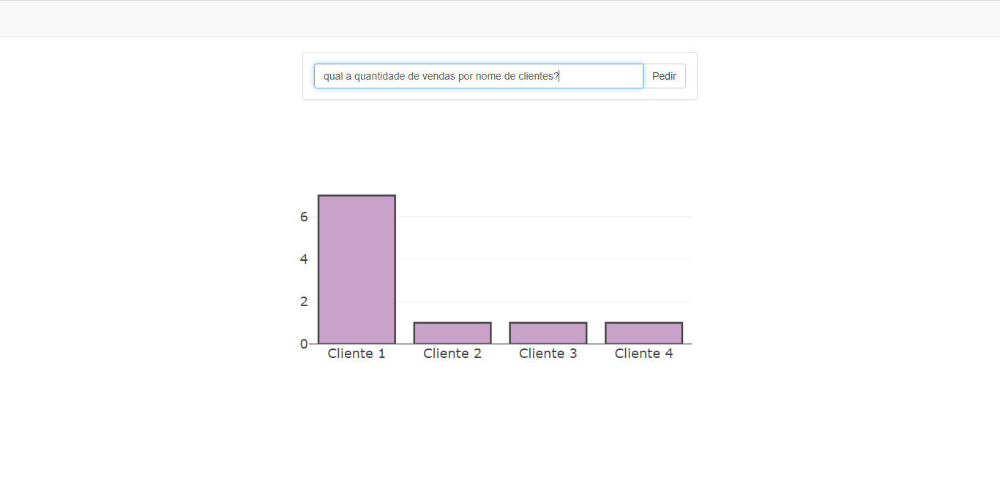
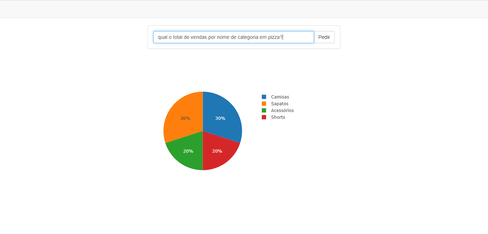
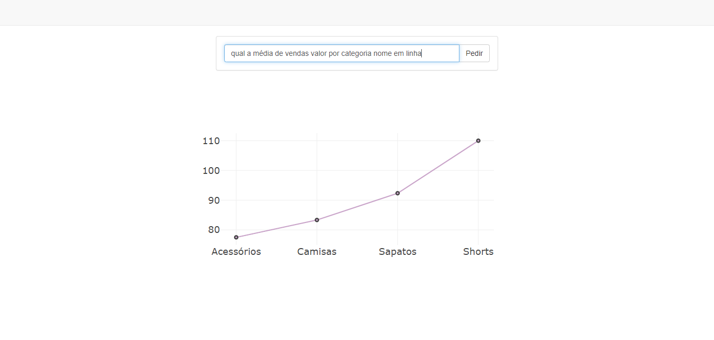

# chatbot-BI
A chatbot that process questions to provide business intelligence answers

## Chatbot
The chatbot was modelled and trained using the Microsoft LUIS API. For security reasons, the chatbot URL_KEY has been omitted in the files

## Queries

